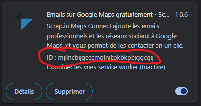

# 🗺️ Scrap Google Maps Business Info with Scrap.io

This guide helps you collect business contact details (emails, phones, websites, etc.) from Google Maps using the **Scrap.io** browser extension and this Python script — no coding skills required!

---

## ✅ What You'll Get

- A spreadsheet (`.xlsx`) with contact info like:
  - Business website
  - Email address
  - Phone number
  - Social links (Facebook, Instagram)
  - Google Maps link

---

## 🔧 What You Need

1. **A computer (Windows, macOS, or Linux)**
2. **Python 3 installed**
3. **Google Chrome or Chromium**
4. **The Scrap.io extension (free)**

---

## 🚀 Step-by-Step Setup

### 1. ✅ Install Python

Go to the official Python website and download the latest version:

🔗 https://www.python.org/downloads/

- During installation, **check the box that says**:  
  `Add Python to PATH`
- Then click **Install Now**

To confirm Python is installed:
- Open your terminal or command prompt
- Type: `python --version`  
  You should see something like `Python 3.11.7` or more

---

### 2. ✅ Install Required Python Packages

Open your terminal or command prompt by typing cmd in the windows search bar and run the commands:

```bash
pip install pandas playwright openpyxl
playwright install
```

This installs the necessary tools for the script to run.

---

### 3. ✅ Install the Scrap.io Extension

Go to the Scrap.io Chrome Web Store page:

🔗 https://chrome.google.com/webstore/detail/scrapio-google-maps-scrap/lhdoppojpmngadmnindnejefpokejbdd

Once installed, you’ll need to find the extension's local path to allow the script to load it.

---

## 🔍 How to Find the Extension Path

1. Open Chrome and go to `chrome://extensions`
2. Enable **Developer Mode** (top right corner)
3. Find **Scrap.io** and click **Details**
4. Copy the **Extension ID** — it's a long string like:  


`mjllncbijgeccmolnikpkbkpbjggcgij`
   

5. On your computer, go to the Chrome **User Data** folder:

   - **Windows:**
     ```
     C:\Users\<YourName>\AppData\Local\Google\Chrome\User Data\
     ```
   - **macOS:**
     ```
     ~/Library/Application Support/Google/Chrome/
     ```
   - **Linux:**
     ```
     ~/.config/google-chrome/
     ```

6. Inside that folder, you may see one or more profiles:
   - `Default` (main profile)
   - `Profile 1`, `Profile 2`, etc. (if you use multiple Chrome users)

7. Check inside each profile's `Extensions` folder:

   **Example (Windows):**
    ```
    C:\Users<YourName>\AppData\Local\Google\Chrome\User Data\Profile 1\Extensions
    ```

8. Find the folder matching the Scrap.io ID (e.g. `mjllncbijgeccmolnikpkbkpbjggcgij`)

9. Open the most recent version folder inside (e.g. `1.6.4_0`)

10. Copy the **full path** of that folder (right click the folder, "Copy as path") — this is the value to use for the `--extension-path` when running the script.

✅ Example:

---

## 🏃 How to Run the Script

## 📦 Download the Script

1. **Download the GitHub repository**:
   - Click the green **Code** button at the top of this GitHub page
   - Choose **Download ZIP**
   - Extract the ZIP file to a folder on your computer

   Or clone it using Git:
   ```bash
   git clone https://github.com/yourusername/your-repo-name.git
   ```

2. Open a terminal or command prompt  
   Use `cd` to go to the folder where the script is:

   ```bash
   cd "C:\Users\YourName\Desktop\scrapio-scraper"
   ```

3. Run the script:

   ```bash
   python scrape_maps.py --extension-path "FULL_PATH_TO_SCRAPIO" --output "my_data.xlsx"
   ```

   Example (on Windows):

   ```bash
   python scrape_maps.py --extension-path "C:\Users\Clara\AppData\Local\Google\Chrome\User Data\Profile 1\Extensions\mjllncbijgeccmolnikpkbkpbjggcgij\1.6.4_0" --output "paris_restaurants.xlsx"
   ```

---

## 🔍 Scraping Instructions

Once the script runs:

1. A Chrome browser will open with Google Maps (This is a normal google maps page, you can search in your native language)
2. Zoom in to the area you want to scrape businesses from
3. Search for a type of business, like **“Florist”** or **“Supermarket”**
4. Go to the list of results on your left and scroll down untill no new results appear
5. Wait for the Scrap.io icons to appear if needed
6. Go back to the terminal and press **Enter**  
   → This scrapes all visible businesses
7. Wait for the terminal to tell you how many businesses were extracted
8. Go back to maps and make a new research to scrape more
9. Repeat as needed
10. Type `STOP` and press **Enter** to finish

The script will clean the data and save it to your Excel file.

---

## 📂 Output Example

| maps_link | email             | phone       | website           | contact_page       | facebook             | instagram             |
|-----------|------------------|-------------|-------------------|--------------------|----------------------|-----------------------|
| https://... | info@domain.com | +33612345678 | www.example.com   | /contact           | fb.com/yourbiz       | instagram.com/yourbiz |

---

## ❓ Troubleshooting

- **Nothing scraped?**  
  → Make sure Scrap.io icons are loaded on the map page before pressing Enter

- **Extension not working?**  
  → Double-check the extension path — it must include the version folder

- **Playwright errors?**  
  → Run `playwright install` again

- **"Permission denied"?**  
  → Try running the terminal as Administrator

---

## 💡 Tips

- Use more specific search terms for better targeting  
  (e.g., `"photographers in Lyon"` instead of just `"photographers"`)

- Zoom in/out on the map if results aren’t loading

- Wait a few seconds after scrolling before scraping again

---

## 🧼 What the Script Does

- Opens Chrome with the Scrap.io extension
- Lets you manually browse Google Maps
- Collects contact info from visible business listings
- Cleans the data (removes duplicates, keeps only useful lines)
- Saves it to Excel

---

## 🛠 Want to Customize?

If you’re more technical, you can:
- Add more social links or business fields
- Save to `.csv` instead of `.xlsx`
- Combine this with email campaigns or CRMs

---

## 📞 Need Help?

Open an issue or contact the author if you’re stuck or want to contribute to the project.

---
